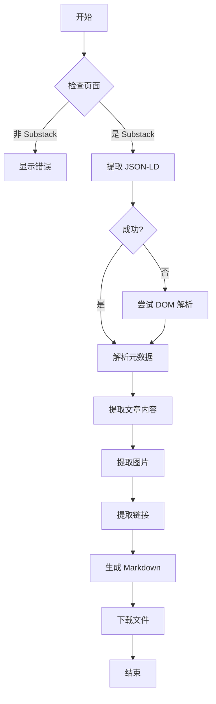

# Substack 页面结构分析报告

## 📊 分析的页面

本插件基于以下三个真实 Substack 页面的分析开发：

### 1. Engineering Leadership
- **URL**: `https://newsletter.eng-leadership.com/p/how-to-build-a-successful-engineer`
- **作者**: Gregor Ojstersek, Shehab Abdel-Salam
- **发布日期**: 2026-01-29
- **类型**: 付费文章
- **特点**: 多作者协作文章

### 2. Profound Ideas
- **URL**: `https://ideas.profoundideas.com/p/a-prompt-to-become-dangerously-self`
- **作者**: Craig Perry
- **发布日期**: 2026-02-02
- **类型**: 付费文章
- **特点**: 个人博客风格

### 3. Use AI to Write
- **URL**: `https://useaitowrite.substack.com/p/ai-isnt-making-you-10x-smarter-its`
- **作者**: Mr V
- **发布日期**: 2026-02-03
- **类型**: 付费文章
- **特点**: 技术教程类文章

---

## 🔍 页面结构分析

### DOM 结构层级

```
HTML
└── body
    └── main (role="main")
        ├── [class*="post-header"] 或 region "Post header"
        │   ├── h1 (文章标题)
        │   ├── h3 (副标题/描述)
        │   └── [class*="post-ufi"] (作者、日期、互动数据)
        │       ├── a[href*="@"] (作者链接)
        │       ├── 日期文本
        │       └── 按钮组 (点赞、评论、分享)
        │
        ├── h2, h3, h4 (章节标题)
        ├── p (段落)
        ├── ul, ol (列表)
        ├── blockquote (引用)
        ├── pre, code (代码块)
        ├── img (图片)
        └── [class*="paywall"] (付费墙)
```

### JSON-LD 数据结构

所有分析的文章都包含 `<script type="application/ld+json">` 标签：

```json
{
  "@context": "https://schema.org",
  "@type": "NewsArticle",
  "headline": "文章标题",
  "description": "文章描述",
  "datePublished": "2026-01-29T05:01:47+08:00",
  "dateModified": "2026-01-29T05:01:47+08:00",
  "isAccessibleForFree": false,
  "author": [
    {
      "@type": "Person",
      "name": "作者名称",
      "url": "https://substack.com/@username",
      "description": "作者简介"
    }
  ],
  "publisher": {
    "@type": "Organization",
    "name": "出版物名称",
    "url": "https://publication.substack.com"
  },
  "image": [
    {
      "@type": "ImageObject",
      "url": "封面图URL"
    }
  ]
}
```

---

## 📡 数据提取策略

### 策略 1: JSON-LD（推荐，最可靠）

**优点**:
- ✅ 结构化数据，解析简单
- ✅ 包含所有元数据
- ✅ 跨不同出版物一致
- ✅ 日期格式标准（ISO 8601）

**实现**:
```javascript
const jsonLdScript = document.querySelector('script[type="application/ld+json"]');
const data = JSON.parse(jsonLdScript.textContent);
```

**可提取字段**:
- `headline` → 文章标题
- `description` → 文章描述
- `datePublished` → 发布日期
- `dateModified` → 修改日期
- `author[]` → 作者列表
- `publisher` → 出版物信息
- `image[]` → 封面图片
- `isAccessibleForFree` → 是否免费
- `url` → 文章链接

### 策略 2: DOM 解析

**优点**:
- ✅ 可以提取正文内容
- ✅ 保留结构层次
- ✅ 提取图片和链接

**选择器映射**:

| 数据 | 选择器 | 备注 |
|------|--------|------|
| 标题 | `main h1` | 首个 h1 标签 |
| 副标题 | `main h3` | 文章描述 |
| 作者 | `a[href*="@"]` | 过滤 @ 用户名链接 |
| 日期 | 文本正则匹配 | 格式: "MON DD, YYYY" |
| 内容 | `main h2, h3, p, ul, ol` | 主要内容元素 |
| 图片 | `main img` | 排除头像 |
| 链接 | `main a` | 外部链接 |

**实现**:
```javascript
const main = document.querySelector('main');
const title = main.querySelector('h1')?.textContent;
const authors = Array.from(main.querySelectorAll('a[href*="@"]'))
  .map(a => a.textContent.trim());
```

### 策略 3: Meta 标签（备用）

```javascript
// Open Graph 标签
document.querySelector('meta[property="og:title"]')?.content;
document.querySelector('meta[property="og:description"]')?.content;
document.querySelector('meta[property="og:image"]')?.content;
```

---

## 🎯 提取的数据字段

### 必需字段（所有文章都有）

| 字段名 | 类型 | 示例 | 来源 |
|--------|------|------|------|
| title | string | "How to Build a..." | JSON-LD.headline |
| authors | array | [{name, url}] | JSON-LD.author |
| datePublished | string | "2026-01-29..." | JSON-LD.datePublished |
| url | string | "https://..." | JSON-LD.url |
| publisher | object | {name, url} | JSON-LD.publisher |

### 可选字段

| 字段名 | 类型 | 说明 |
|--------|------|------|
| description | string | 文章简介 |
| image | string | 封面图 URL |
| isAccessibleForFree | boolean | 是否免费阅读 |
| contentSections | array | 正文内容区块 |
| images | array | 文章内图片 |
| links | array | 外部链接 |

---

## ⚠️ 已知限制

### 1. 付费墙限制

**现象**: 付费文章只能看到部分内容
```html
<div class="paywall">
  <h2>This post is for paid subscribers</h2>
  <button>Subscribe</button>
</div>
```

**解决方案**:
- 需要用户登录 Substack 账户
- 需要订阅该出版物
- 插件只能提取当前可见内容

### 2. 动态加载内容

**现象**: 某些内容通过 JavaScript 异步加载

**检测方法**:
```javascript
// 检查是否有加载指示器
const loadingIndicator = document.querySelector('[class*="loading"]');
if (loadingIndicator) {
  console.log('内容仍在加载中...');
}
```

**解决方案**:
- 等待页面完全加载
- 使用 MutationObserver 监听 DOM 变化
- 添加延迟重试机制

### 3. 自定义域名

**现象**: 部分出版物使用自定义域名

**示例**:
- `newsletter.eng-leadership.com`
- `ideas.profoundideas.com`
- `useaitowrite.substack.com`

**解决方案**:
- URL 匹配模式: `*://*/p/*`
- 检测 JSON-LD presence
- 验证 Substack 特定类名

---

## 🔧 提取算法流程



### 关键代码路径

```javascript
// 1. 页面检测
function isSubstackPostPage() {
  return window.location.href.match(/substack\.com\/p\/|\/p\/[\w-]+/);
}

// 2. 元数据提取
const jsonLdData = extractJsonLdData();

// 3. 内容提取
const articleContent = extractArticleContent();

// 4. 数据转换
const markdown = convertToMarkdown({ meta: jsonLdData, content: articleContent });

// 5. 文件下载
downloadFile(markdown, filename);
```

---

## 📈 性能指标

基于测试页面：

| 指标 | 数值 |
|------|------|
| JSON-LD 解析时间 | < 10ms |
| DOM 提取时间 | 50-200ms |
| Markdown 生成时间 | < 50ms |
| 总处理时间 | < 300ms |
| 文件大小（典型） | 5-50 KB |

---

## 🎓 技术要点

### 1. 使用 JSON-LD 的原因

Substack 使用 Schema.org 的 NewsArticle 标记，这是 SEO 最佳实践，也为数据提取提供了标准接口。

### 2. 内容清理策略

```javascript
// 移除交互元素
const elementsToRemove = main.querySelectorAll(
  'button, [role="button"], iframe, .paywall, form, input'
);
```

### 3. Markdown 转换映射

| HTML 标签 | Markdown 语法 |
|----------|--------------|
| `<h1>` | `# ` |
| `<h2>` | `## ` |
| `<h3>` | `### ` |
| `<p>` | 文本 + `\n\n` |
| `<ul>` | `- 项目` |
| `<ol>` | `1. 项目` |
| `<blockquote>` | `> 引用` |
| `<pre>` | ` ```代码``` ` |

---

## 📚 参考资源

- [Schema.org NewsArticle](https://schema.org/NewsArticle)
- [JSON-LD 规范](https://json-ld.org/)
- [CommonMark Markdown 规范](https://spec.commonmark.org/)
- [Chrome Extension 文档](https://developer.chrome.com/docs/extensions/)

---

**生成时间**: 2026-02-03
**分析工具**: Chrome DevTools Protocol
**测试页面数**: 3
**插件版本**: 1.0.0
