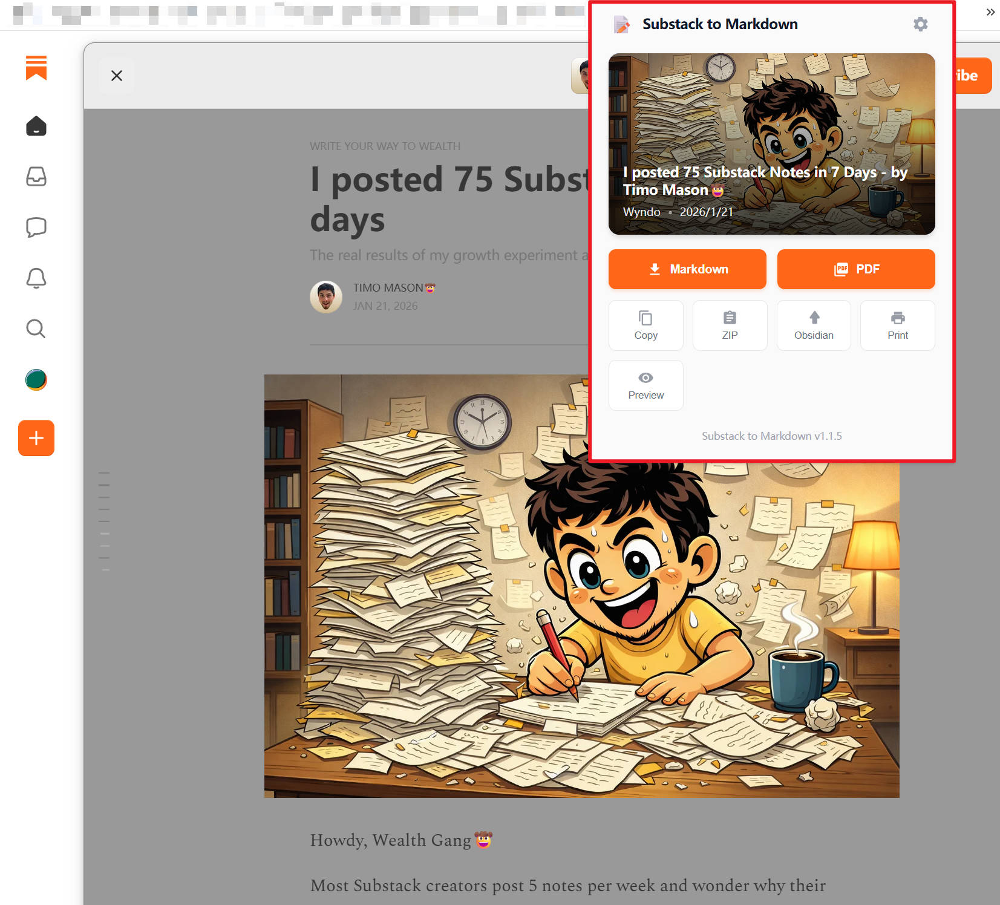

# Substack to Markdown Chrome 插件



一个强大的 Chrome 浏览器插件，用于从 Substack 文章页面提取标题、作者、日期、内容等信息并保存为 Markdown 格式。

## ✨ 功能特性

### 核心功能
- ✅ **智能识别**：自动识别 Substack 文章页面
- 📋 **元数据提取**：标题、作者、发布日期、描述、出版社信息
- 🖼️ **图片保留**：图片保留在原始位置，脱离上下文
- 🔗 **链接收集**：提取文章内的所有外部链接
- 📝 **格式良好**：生成标准 Markdown 格式
- 💾 **一键下载**：自动保存到本地
- 👁️ **实时预览**：预览生成的 Markdown 内容

### v1.1.6 新增特性 ⭐
- 🔗 **支持 /@username/p-xxx URL 格式**（个人资料文章页面）
- 🧠 **智能提取**：检测 JSON-LD Person 类型并优先使用 og:title/og:image
- 📅 **日期解析增强**：正则表达式不区分大小写（支持 FEB、Feb 等格式）
- 👥 **多作者支持**：支持多作者显示
- 🏷️ **品牌标识**：添加 "Powered By Activer" 署名
- 📄 **PDF 署名**：生成的 PDF 底部添加品牌页脚
- 🖼️ **文档优化**：README 添加预览图片

### v1.1.5 新增特性 ⭐
- 📄 **客户端 PDF 导出**：使用 pdfmake 直接生成高质量 PDF，无需打印对话框
- 🎨 **UI/UX 全面升级**：沉浸式卡片布局、骨架屏加载、空状态设计
- 🔤 **中英文字体支持**：集成 Noto Serif SC，完美支持中英文混排
- 🧠 **智能语言检测**：自动识别文章语言并优化排版

### v1.0 新增特性 ⭐
- 🎯 **支持首页阅读器模式**：`substack.com/inbox/post/p-xxx` 和 `substack.com/home/post/p-xxx`
- 🧠 **DOM 解析回退**：无 JSON-LD 时智能提取元数据
- 🔍 **调试日志**：详细的控制台日志，方便定位问题
- 🌐 **自定义域名支持**：完美支持所有 Substack 自定义域名
- 📅 **中文文件名**：支持中文字符和特殊字符
- 🛡️ **智能过滤**：自动过滤导航、按钮等无关内容
- 📋 **剪贴板支持**：一键复制 Markdown 内容
- 👁️ **预览模式**：下载前预览生成的 Markdown
- 📦 **图片本地化**：ZIP 导出包含本地图片
- 🔗 **Obsidian 集成**：直接保存到 Obsidian vault
- 🖨️ **PDF 导出**：优化的打印样式
- ⚙️ **YAML Frontmatter**：支持 Obsidian/Notion 元数据
- 📁 **自定义文件名**：多种命名格式选项

## 🎯 支持的页面类型

### 1. 文章详情页（推荐）

**URL 格式：**
- `https://xxx.substack.com/p/文章标题`
- `https://自定义域名.com/p/文章标题`

**提取方式：**
- ✅ 使用 JSON-LD 结构化数据
- ✅ 完整的元数据（标题、作者、日期、描述）
- ✅ 高质量内容提取

### 2. 首页阅读器模式（v1.0.1 新增）⭐

**URL 格式：**
- `https://substack.com/inbox/post/p-xxx`
- `https://substack.com/home/post/p-xxx`

**提取方式：**
- ✅ 使用 DOM 解析提取元数据
- ✅ 智能提取标题、作者、日期
- ✅ 完整的文章内容提取

### 3. 不支持的页面

**URL 格式：**
- `https://substack.com/home` （纯首页信息流）

**原因：** 显示文章列表/预览，没有完整内容

## 🚀 安装方法

### 开发模式安装

1. 克隆或下载此项目
```bash
git clone https://github.com/yourusername/chrome-plugin-substack.git
```

2. 打开 Chrome 浏览器，访问 `chrome://extensions/`

3. 开启右上角的"开发者模式"

4. 点击"加载已解压的扩展程序"

5. 选择项目文件夹

## 📖 使用方法

### 基本使用

1. 访问任意 Substack 文章页面
   - 文章详情页：`https://newsletter.eng-leadership.com/p/xxx`
   - 首页阅读器：`https://substack.com/inbox/post/p-xxx`（需登录）

2. 点击浏览器工具栏中的插件图标

3. 查看提取的文章信息

4. 点击"🚀 提取并下载 Markdown"按钮

5. 选择保存位置，文件将自动下载

### 调试模式

如果遇到问题，可以查看控制台日志：

1. 打开浏览器控制台（按 **F12**，切换到 **Console** 标签）

2. 刷新页面并打开插件

3. 查看详细的日志输出：

```
[Popup] ========== 开始检查页面 ==========
[Popup] 当前标签页 URL: https://...
[Popup] ✅ 是 Substack 相关页面
[Injected] 开始执行提取逻辑...
[Injected] ✅ 提取完成: {sectionsCount: 45, imagesCount: 3}
```

## 📄 生成的 Markdown 格式

```markdown
# 文章标题

## 📋 文章信息

- **作者**: 作者名称
- **发布日期**: 2026年2月4日
- **出版社**: [出版物名称](URL)
- **原文链接**: https://...

## 📝 简介

文章描述...

## 🖼️ 封面


## 📖 正文

### 章节标题

段落内容...

更多段落...

## 🔗 相关链接

- [链接文本](URL)

---

*提取时间: 2026年2月4日*
*由 [Substack to Markdown](https://github.com) 插件生成*
```

## 🛠️ 技术实现

### 数据提取策略

插件使用多种策略来提取文章数据：

#### 1. JSON-LD 结构化数据（优先）
```javascript
const jsonLdScript = document.querySelector('script[type="application/ld+json"]');
const data = JSON.parse(jsonLdScript.textContent);
```

#### 2. DOM 解析（回退方案）
```javascript
// 标题提取
document.title

// 作者提取
document.querySelector('a[href*="/@"]')

// 日期提取
正则匹配: /^[A-Z][a-z]{2}\s+\d{1,2},\s+\d{4}$/

// 内容容器
document.querySelector('.body.markup')
```

### 提取的数据字段

| 字段 | 来源 | 说明 |
|------|------|------|
| 标题 | JSON-LD / document.title | 文章主标题 |
| 副标题 | h3 | 文章描述性副标题 |
| 作者 | JSON-LD / DOM | 作者名称和链接 |
| 发布日期 | JSON-LD / DOM | 格式化日期 |
| 出版社 | JSON-LD / DOM | Substack 出版物信息 |
| 封面图 | JSON-LD | 主文章图片 |
| 正文内容 | DOM | 文章所有段落和标题 |
| 图片 | DOM | 文章内的所有图片（保留原位置） |
| 链接 | DOM | 文章内的所有外部链接 |

## 📊 版本历史

### v1.1.6 (2026-02-05)
- 🔗 **新增**：支持 `/@username/p-xxx` URL 格式（个人资料文章页面）
- 🧠 **智能提取**：检测 JSON-LD Person 类型并优先使用 og:title/og:image
- 📅 **修复**：日期正则表达式改为不区分大小写（支持 FEB、Feb 等格式）
- 👥 **多作者**：支持多作者显示
- 🏷️ **品牌标识**：添加 "Powered By Activer" 署名
- 📄 **PDF 署名**：生成的 PDF 底部添加品牌页脚
- 🖼️ **文档优化**：README 添加预览图片

### v1.1.5 (2026-02-05)
- 🎉 **版本升级**：次版本号提升，反映重大功能更新
- 📄 **客户端 PDF 导出**：使用 pdfmake 直接生成高质量 PDF，无需打印对话框
- 🎨 **UI/UX 全面升级**：沉浸式卡片布局、骨架屏加载、空状态设计
- 🔤 **中英文字体支持**：集成 Noto Serif SC，完美支持中英文混排
- 🧠 **智能语言检测**：自动识别文章语言并优化排版
- 🔧 **设置面板增强**：新增"纯净模式"选项，过滤推广内容
- 📊 **操作反馈优化**：所有按钮的状态提示（Processing/Exported/Saved）

### v1.0.4 (2026-02-05)
- 🐛 **修复**：设置按钮点击无响应问题（JS 与 CSS 显示机制不一致）
- ✨ **改进**：设置面板视觉增强（渐变背景、橙色强调线、增强阴影、圆角）
- 🎨 **改进**：设置图标替换为 Material Design 风格，与底部按钮保持一致
- ✨ **新增**：点击外部区域自动关闭设置面板
- ✨ **新增**：Escape 键关闭设置面板和预览模态框

### v1.0.3 (2026-02-04)
- 🐛 **修复**：PDF 打印时标题上方的空白区域（~100px）
- 🔧 **改进**：重置 modalViewer 和 article 的 padding/margin
- 🔧 **改进**：打印时标题直接位于页面顶部
- 🔍 **分析**：使用 Chrome DevTools MCP 工具定位问题根源

### v1.0.2 (2026-02-04)
- 🐛 **修复**：图片保留在文章中的原始位置
- ✨ **改进**：使用 `.body.markup` 容器提取内容
- 🗑️ **删除**：移除末尾的单独图片列表

### v1.0.1 (2026-02-04)
- ✨ **新增**：支持首页阅读器模式（`substack.com/inbox/post/p-xxx` 和 `substack.com/home/post/p-xxx`）
- ✨ **新增**：DOM 解析提取元数据（无 JSON-LD 时的回退方案）
- 🐛 **修复**：提取正确的文章标题和发布者
- 📝 **改进**：详细的调试日志输出
- 🌐 **改进**：支持自定义域名
- 📅 **改进**：文件名支持中文字符

### v1.0.0 (2026-02-04)
- ✨ 初始版本
- ✅ 支持文章详情页
- ✅ JSON-LD 提取
- ✅ Markdown 转换

## 🔧 配置与权限

### 权限说明

插件需要以下权限：

- `activeTab` - 访问当前活动标签页
- `scripting` - 注入脚本到页面
- `downloads` - 下载生成的 Markdown 文件
- `host_permissions` - 访问 substack.com 及其子域名

### 文件结构

```
chrome-plugin-substack/
├── manifest.json       # Manifest V3 配置
├── content.js          # 内容脚本（注入到页面）
├── popup.js            # 弹出窗口逻辑
├── popup.html          # 弹出窗口界面
├── background.js       # 后台服务脚本
├── icons/              # 图标文件
│   ├── icon16.png
│   ├── icon48.png
│   └── icon128.png
├── README.md           # 本文档
└── task-plan.md       # 开发规划（归档）
```

## 🐛 常见问题

### Q: 为什么显示"无法提取文章信息"？

**A:** 请确保：
- ✅ 你在**文章详情页**或**首页阅读器页面**（URL 包含 `/p/xxx` 或 `/inbox/post/p-xxx`）
- ✅ **已登录 Substack**（首页阅读器模式需要登录）
- ✅ 页面已完全加载

### Q: 提取的内容为空？

**A:** 可能的原因：
- ⚠️ 页面还在加载中，请等待几秒后重试
- ⚠️ 文章可能是付费内容，需要订阅
- ⚠️ 打开控制台查看具体错误日志

### Q: 文件名乱码？

**A:** 已在 v1.0.1 修复，现在支持中文字符和特殊字符

### Q: 图片都放在文档末尾？

**A:** 已在 v1.0.2 修复，图片现在保留在原始位置

### Q: 支持批量下载吗？

**A:** 当前版本不支持，但已在规划中（见下文"未来计划"）

## 🔮 未来计划

### ✅ 已完成功能（v1.0.0 - v1.1.6）
- [x] **图片本地化**：ZIP 导出包含本地图片（v1.0.x）
- [x] **Obsidian 集成**：一键保存到 Obsidian（v1.0.x）
- [x] **自定义模板**：YAML Frontmatter + 文件名格式选择（v1.0.x）
- [x] **剪贴板支持**：一键复制 Markdown（v1.0.x）
- [x] **预览模式**：下载前预览生成的内容（v1.0.x）
- [x] **脚注支持**：标准 Markdown 脚注格式（v1.0.x）
- [x] **PDF 导出（打印）**：优化的打印样式（v1.0.3 修复空白问题）
- [x] **PDF 直接导出**：客户端生成 PDF，支持中英文混排（v1.1.5）
- [x] **UI/UX 全面升级**：沉浸式卡片、骨架屏、空状态（v1.1.5）
- [x] **操作反馈优化**：所有按钮的状态提示（v1.1.5）
- [x] **纯净模式**：过滤推广和营销内容（v1.1.5）
- [x] **个人资料页面支持**：支持 /@username/p-xxx URL 格式（v1.1.6）
- [x] **品牌标识**：添加 "Powered By Activer" 署名（v1.1.6）

### 🔄 进行中/计划中

#### 高优先级（下一版本）
- [x] **纯净模式**：过滤推广和营销内容（v1.1.5 已完成）
- [ ] **批量下载**：支持一键下载整个订阅源归档（v1.2.0 规划中）
- [ ] **Chrome Web Store 发布**：完成合规性检查并提交审核

#### 中优先级
- [ ] **代码模块化**：拆分 popup.js 提升可维护性
- [ ] **Notion 集成**：一键推送到 Notion 数据库
- [ ] **多平台支持**：Medium、Ghost 等其他平台
- [ ] **快捷键支持**：Alt+M 快速提取
- [ ] **全文搜索**：搜索已下载的文章
- [ ] **标签分类**：自动添加标签和分类

#### 低优先级（实验性）
- [ ] **AI 摘要**：集成 AI API 生成文章摘要
- [ ] **WebDAV 同步**：支持坚果云、Nextcloud 等网盘
- [ ] **本地数据库**：IndexedDB 存储下载历史

---

**查看完整开发规划**：参见 [task-plan.md](./task-plan.md)

### 低优先级
- [ ] **AI 摘要**：集成 AI API 生成摘要
- [ ] **翻译功能**：自动翻译英文文章为中文
- [ ] **订阅管理**：管理关注的作者，自动检测新文章
- [ ] **开放 API**：供其他扩展调用

## 🤝 贡献

欢迎提交 Issue 和 Pull Request！

### 开发环境设置

1. Fork 本项目
2. 创建特性分支 (`git checkout -b feature/AmazingFeature`)
3. 提交更改 (`git commit -m 'Add some AmazingFeature'`)
4. 推送到分支 (`git push origin feature/AmazingFeature`)
5. 开启 Pull Request

## 📜 许可证

MIT License

---

**最后更新**: 2026-02-05
**当前版本**: v1.1.6
**Happy Extracting! 🚀**
